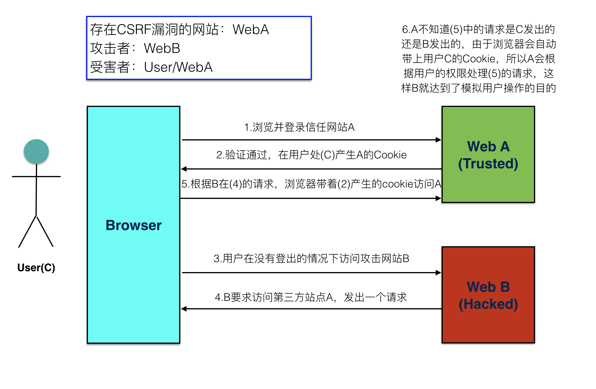
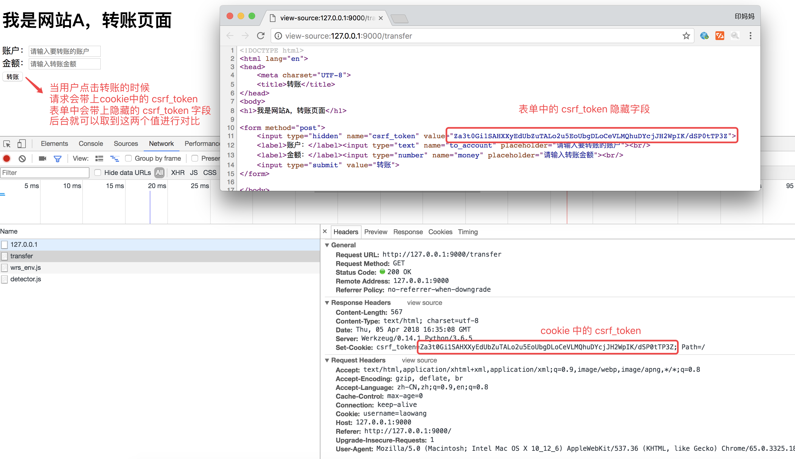
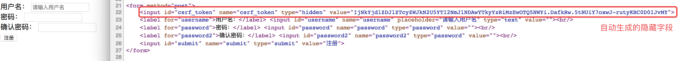

# CSRF

  * `CSRF`全拼为`Cross Site Request Forgery`，译为跨站请求伪造。
  * `CSRF`指攻击者盗用了你的身份，以你的名义发送恶意请求。
    * 包括：以你名义发送邮件，发消息，盗取你的账号，甚至于购买商品，虚拟货币转账......
  * 造成的问题：个人隐私泄露以及财产安全。

## CSRF攻击示意图

  * 客户端访问服务器时没有同服务器做安全验证

## 防止 CSRF 攻击

### 步骤

  1. 在客户端向后端请求界面数据的时候，后端会往响应中的 cookie 中设置 csrf\_token 的值
  2. 在 Form 表单中添加一个隐藏的的字段，值也是 csrf\_token
  3. 在用户点击提交的时候，会带上这两个值向后台发起请求
  4. 后端接受到请求，以会以下几件事件：
    * 从 cookie中取出 csrf\_token
    * 从 表单数据中取出来隐藏的 csrf\_token 的值
    * 进行对比
  5. 如果比较之后两值一样，那么代表是正常的请求，如果没取到或者比较不一样，代表不是正常的请求，不执行下一步操作

### 代码演示

#### 未进行 csrf 校验的 WebA

  * 后端代码实现



    from flask import Flask, render_template, make_response
    from flask import redirect
    from flask import request
    from flask import url_for
    
    app = Flask(__name__)
    
    
    @app.route('/', methods=["POST", "GET"])
    def index():
        if request.method == "POST":
            # 取到表单中提交上来的参数
            username = request.form.get("username")
            password = request.form.get("password")
    
            if not all([username, password]):
                print('参数错误')
            else:
                print(username, password)
                if username == 'laowang' and password == '1234':
                    # 状态保持，设置用户名到cookie中表示登录成功
                    response = redirect(url_for('transfer'))
                    response.set_cookie('username', username)
                    return response
                else:
                    print('密码错误')
    
        return render_template('temp_login.html')
    
    
    @app.route('/transfer', methods=["POST", "GET"])
    def transfer():
        # 从cookie中取到用户名
        username = request.cookies.get('username', None)
        # 如果没有取到，代表没有登录
        if not username:
            return redirect(url_for('index'))
    
        if request.method == "POST":
            to_account = request.form.get("to_account")
            money = request.form.get("money")
            print('假装执行转操作，将当前登录用户的钱转账到指定账户')
            return '转账 %s 元到 %s 成功' % (money, to_account)
    
        # 渲染转换页面
        response = make_response(render_template('temp_transfer.html'))
        return response
    
    if __name__ == '__main__':
        app.run(debug=True, port=9000)
    


  * 前端登录页面代码



    <!DOCTYPE html>
    &lt;html lang="en"&gt;
    &lt;head&gt;
        &lt;meta charset="UTF-8"&gt;
        &lt;title&gt;登录&lt;/title&gt;
    &lt;/head&gt;
    &lt;body&gt;
    
    &lt;h1&gt;我是网站A，登录页面&lt;/h1&gt;
    
    &lt;form method="post"&gt;
        &lt;label&gt;用户名：&lt;/label&gt;&lt;input type="text" name="username" placeholder="请输入用户名"&gt;&lt;br/&gt;
        &lt;label&gt;密码：&lt;/label&gt;&lt;input type="password" name="password" placeholder="请输入密码"&gt;&lt;br/&gt;
        &lt;input type="submit" value="登录"&gt;
    &lt;/form&gt;
    
    &lt;/body&gt;
    &lt;/html&gt;
    


  * 前端转账页面代码



    <!DOCTYPE html>
    &lt;html lang="en"&gt;
    &lt;head&gt;
        &lt;meta charset="UTF-8"&gt;
        &lt;title&gt;转账&lt;/title&gt;
    &lt;/head&gt;
    &lt;body&gt;
    &lt;h1&gt;我是网站A，转账页面&lt;/h1&gt;
    
    &lt;form method="post"&gt;
        &lt;label&gt;账户：&lt;/label&gt;&lt;input type="text" name="to_account" placeholder="请输入要转账的账户"&gt;&lt;br/&gt;
        &lt;label&gt;金额：&lt;/label&gt;&lt;input type="number" name="money" placeholder="请输入转账金额"&gt;&lt;br/&gt;
        &lt;input type="submit" value="转账"&gt;
    &lt;/form&gt;
    
    &lt;/body&gt;
    &lt;/html&gt;
    


> 运行测试，如果在未登录的情况下，不能直接进入转账页面，测试转账是成功的

#### 攻击网站B的代码

  * 后端代码实现



    from flask import Flask
    from flask import render_template
    
    app = Flask(__name__)
    
    @app.route('/')
    def index():
        return render_template('temp_index.html')
    
    if __name__ == '__main__':
        app.run(debug=True, port=8000)
    


  * 前端代码实现



    <!DOCTYPE html>
    &lt;html lang="en"&gt;
    &lt;head&gt;
        &lt;meta charset="UTF-8"&gt;
        &lt;title&gt;Title&lt;/title&gt;
    &lt;/head&gt;
    &lt;body&gt;
    
    &lt;h1&gt;我是网站B&lt;/h1&gt;
    
    &lt;form method="post" action="http://127.0.0.1:9000/transfer"&gt;
        &lt;input type="hidden" name="to_account" value="999999"&gt;
        &lt;input type="hidden" name="money" value="190000" hidden&gt;
        &lt;input type="submit" value="点击领取优惠券"&gt;
    &lt;/form&gt;
    
    &lt;/body&gt;
    &lt;/html&gt;
    


> 运行测试，在用户登录网站A的情况下，点击网站B的按钮，可以实现伪造访问

#### 在网站A中模拟实现 csrf\_token 校验的流程

  * 添加生成 csrf\_token 的函数



    # 生成 csrf_token 函数
    def generate_csrf():
        return bytes.decode(base64.b64encode(os.urandom(48)))
    


  * 在渲染转账页面的，做以下几件事情：
    * 生成 csrf\_token 的值
    * 在返回转账页面的响应里面设置 csrf\_token 到 cookie 中
    * 将 csrf\_token 保存到表单的隐藏字段中



    @app.route('/transfer', methods=["POST", "GET"])
    def transfer():
        ...
        # 生成 csrf_token 的值
        csrf_token = generate_csrf()
    
        # 渲染转换页面，传入 csrf_token 到模板中
        response = make_response(render_template('temp_transfer.html', csrf_token=csrf_token))
        # 设置csrf_token到cookie中，用于提交校验
        response.set_cookie('csrf_token', csrf_token)
        return response
    


  * 在转账模板表单中添加 csrf\_token 隐藏字段



    &lt;form method="post"&gt;
        &lt;input type="hidden" name="csrf_token" value="{{ csrf_token }}"&gt;
        &lt;label&gt;账户：&lt;/label&gt;&lt;input type="text" name="to_account" placeholder="请输入要转账的账户"&gt;&lt;br/&gt;
        &lt;label&gt;金额：&lt;/label&gt;&lt;input type="number" name="money" placeholder="请输入转账金额"&gt;&lt;br/&gt;
        &lt;input type="submit" value="转账"&gt;
    &lt;/form&gt;
    


  * 运行测试，进入到转账页面之后，查看 cookie 和 html 源代码

  * 在执行转账逻辑之前进行 csrf\_token 的校验



    if request.method == "POST":
        to_account = request.form.get("to_account")
        money = request.form.get("money")
        # 取出表单中的 csrf_token
        form_csrf_token = request.form.get("csrf_token")
        # 取出 cookie 中的 csrf_token
        cookie_csrf_token = request.cookies.get("csrf_token")
        # 进行对比
        if cookie_csrf_token != form_csrf_token:
            return 'token校验失败，可能是非法操作'
        print('假装执行转操作，将当前登录用户的钱转账到指定账户')
        return '转账 %s 元到 %s 成功' % (money, to_account)
    


运行测试，用户直接在网站 A 操作没有问题，再去网站B进行操作，发现转账不成功，因为网站 B 获取不到表单中的 csrf\_token
的隐藏字段，而且浏览器有 **同 源策略**，网站B是获取不到网站A的 cookie 的，所以就解决了 **跨 站请求伪造**的问题

## 在 Flask 项目中解决 CSRF 攻击

在 Flask 中， Flask-wtf 扩展有一套完善的 csrf 防护体系，对于我们开发者来说，使用起来非常简单

### 在 FlaskForm 中实现校验

  * 设置应用程序的 secret\_key
    * 用于加密生成的 csrf\_token 的值



    app.secret_key = "#此处可以写随机字符串#"
    


  * 在模板的表单中添加以下代码



    &lt;form method="post"&gt;
        {{ form.csrf_token() }}
        {{ form.username.label }} {{ form.username }}&lt;br/&gt;
        {{ form.password.label }} {{ form.password }}&lt;br/&gt;
        {{ form.password2.label }} {{ form.password2 }}&lt;br/&gt;
        {{ form.submit }}
    &lt;/form&gt;
    


  * 渲染出来的前端页面为：

> 设置完毕，cookie 中的 csrf\_token 不需要我们关心，会自动帮我们设置

### 单独使用

  * 设置应用程序的 secret\_key
    * 用于加密生成的 csrf\_token 的值



    app.secret_key = "#此处可以写随机字符串#"
    


  * 导入 flask\_wtf.csrf 中的 CSRFProtect 类，进行初始化，并在初始化的时候关联 app 



    from flask.ext.wtf import CSRFProtect
    CSRFProtect(app)
    


  * 如果模板中有表单，不需要做任何事。与之前一样:



    &lt;form method="post"&gt;
        {{ form.csrf_token }}
        ...
    &lt;/form&gt;
    


  * 但如果模板中没有表单，你仍需要 CSRF 令牌:



    &lt;form method="post" action="/"&gt;
        &lt;input type="hidden" name="csrf_token" value="{{ csrf_token() }}" /&gt;
    &lt;/form&gt;
    


> 后续项目中会使用到此功能

____

