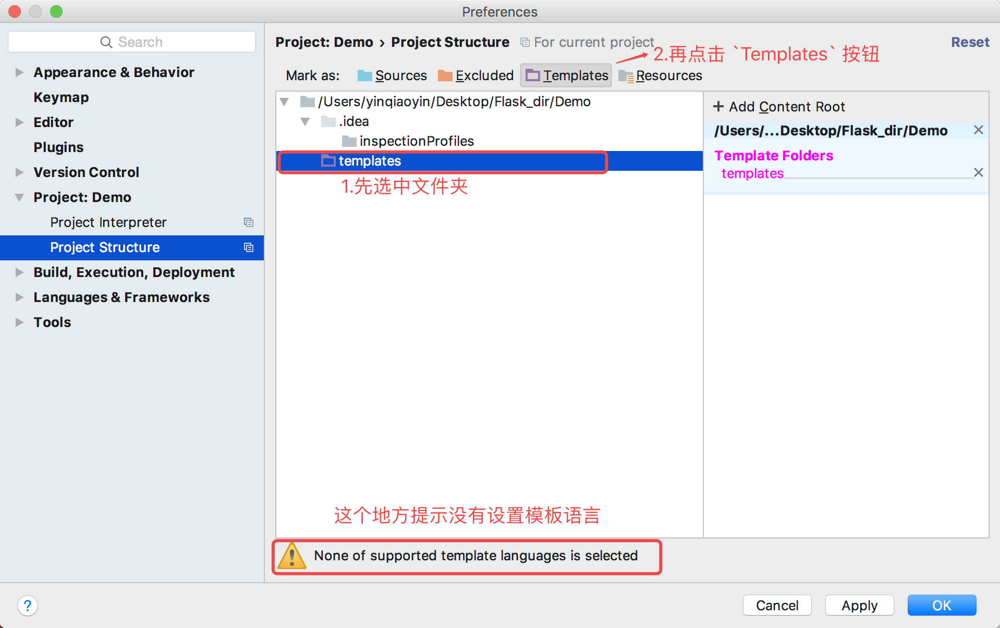
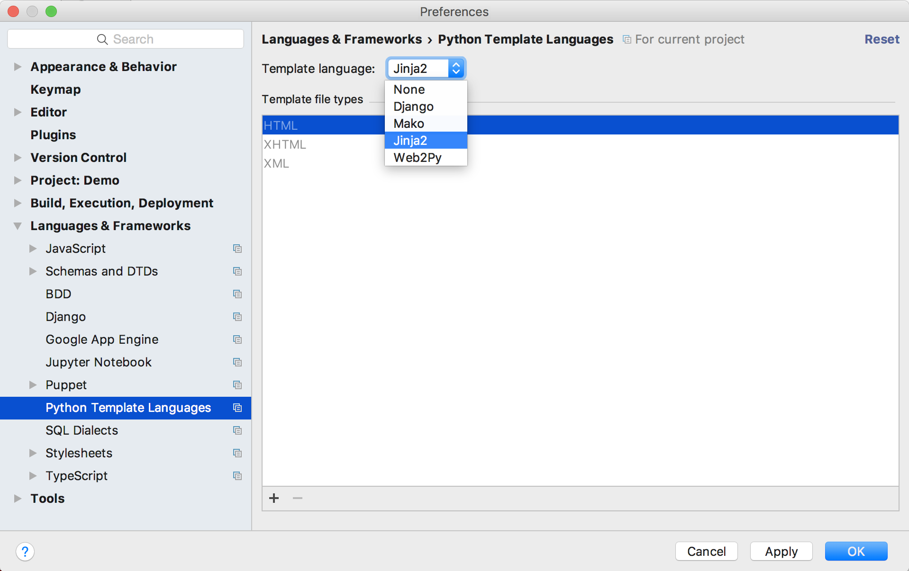

# 模板的使用

  * 在项目下创建 `templates` 文件夹，用于存放所有的模板文件，并在目录下创建一个模板html文件 `temp_demo1.html`



    <!DOCTYPE html>
    &lt;html lang="en"&gt;
    &lt;head&gt;
        &lt;meta charset="UTF-8"&gt;
        &lt;title&gt;Title&lt;/title&gt;
    &lt;/head&gt;
    &lt;body&gt;
    我的模板html内容
    &lt;/body&gt;
    &lt;/html&gt;
    


  * 设置 templates 文件夹属性以便能够在代码中有智能提示

  * 设置 html 中的模板语言，以便在 html 有智能提示

  * 创建视图函数，将该模板内容进行渲染返回



    @app.route('/')
    def index():
        return render_template('temp_demo1.html')
    


> 访问：http://127.0.0.1:5000/ 运行测试

  * 代码中传入字符串，列表，字典到模板中



    @app.route('/')
    def index():
        # 往模板中传入的数据
        my_str = 'Hello 黑马程序员'
        my_int = 10
        my_array = [3, 4, 2, 1, 7, 9]
        my_dict = {
            'name': 'xiaoming',
            'age': 18
        }
        return render_template('temp_demo1.html',
                               my_str=my_str,
                               my_int=my_int,
                               my_array=my_array,
                               my_dict=my_dict
                               )
    


  * 模板中代码



    <!DOCTYPE html>
    &lt;html lang="en"&gt;
    &lt;head&gt;
        &lt;meta charset="UTF-8"&gt;
        &lt;title&gt;Title&lt;/title&gt;
    &lt;/head&gt;
    &lt;body&gt;
    我的模板html内容
    &lt;br/&gt;{{ my_str }}
    &lt;br/&gt;{{ my_int }}
    &lt;br/&gt;{{ my_array }}
    &lt;br/&gt;{{ my_dict }}
    
    &lt;/body&gt;
    &lt;/html&gt;
    


  * 运行效果

<\!DOCTYPE html>

我的模板html内容  
Hello 黑马程序员  
10  
\[3, 4, 2, 1, 7, 9\]  
\{'name': 'xiaoming', 'age': 18\}

  * 相关运算，取值



    &lt;br/&gt; my_int + 10 的和为：{{ my_int + 10 }}
    &lt;br/&gt; my_int + my_array第0个值的和为：{{ my_int + my_array[0] }}
    &lt;br/&gt; my_array 第0个值为：{{ my_array[0] }}
    &lt;br/&gt; my_array 第1个值为：{{ my_array.1 }}
    &lt;br/&gt; my_dict 中 name 的值为：{{ my_dict['name'] }}
    &lt;br/&gt; my_dict 中 age 的值为：{{ my_dict.age }}
    


  * 结果



    my_int + 10 的和为：20 
    my_int + my_array第0个值的和为：13 
    my_array 第0个值为：3 
    my_array 第1个值为：4 
    my_dict 中 name 的值为：xiaoming 
    my_dict 中 age 的值为：18
    


____

