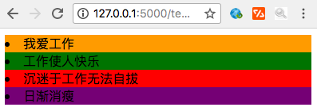

# 控制代码块

控制代码块主要包含两个：



    - if/else if /else / endif
    - for / endfor
    


## if语句

Jinja2 语法中的if语句跟 Python 中的 if 语句相似,后面的布尔值或返回布尔值的表达式将决定代码中的哪个流程会被执行:



    
        &lt;a href='/logout'&gt;Logout&lt;/a&gt;
    
        &lt;a href='/login'&gt;Login&lt;/a&gt;
    
    


过滤器可以被用在 if 语句中:



    
        There are {{ comments | length }} comments
    
        There are no comments
    
    


## 循环

  * 我们可以在 Jinja2 中使用循环来迭代任何列表或者生成器函数



    
        &lt;div&gt;
            &lt;h1&gt;{{ post.title }}&lt;/h1&gt;
            &lt;p&gt;{{ post.text | safe }}&lt;/p&gt;
        &lt;/div&gt;
    
    


  * 循环和if语句可以组合使用，以模拟 Python 循环中的 continue 功能，下面这个循环将只会渲染post.text不为None的那些post：



    
        &lt;div&gt;
            &lt;h1&gt;{{ post.title }}&lt;/h1&gt;
            &lt;p&gt;{{ post.text | safe }}&lt;/p&gt;
        &lt;/div&gt;
    
    


  * 在一个 for 循环块中你可以访问这些特殊的变量:

  
<table>  
<tr>  
<th>

变量

</th>  
<th>

描述

</th> </tr>  
<tr>  
<td>

loop.index

</td>  
<td>

当前循环迭代的次数（从 1 开始）

</td> </tr>  
<tr>  
<td>

loop.index0

</td>  
<td>

当前循环迭代的次数（从 0 开始）

</td> </tr>  
<tr>  
<td>

loop.revindex

</td>  
<td>

到循环结束需要迭代的次数（从 1 开始）

</td> </tr>  
<tr>  
<td>

loop.revindex0

</td>  
<td>

到循环结束需要迭代的次数（从 0 开始）

</td> </tr>  
<tr>  
<td>

loop.first

</td>  
<td>

如果是第一次迭代，为 True 。

</td> </tr>  
<tr>  
<td>

loop.last

</td>  
<td>

如果是最后一次迭代，为 True 。

</td> </tr>  
<tr>  
<td>

loop.length

</td>  
<td>

序列中的项目数。

</td> </tr>  
<tr>  
<td>

loop.cycle

</td>  
<td>

在一串序列间期取值的辅助函数。见下面示例程序。

</td> </tr> </table>

  * 在循环内部,你可以使用一个叫做loop的特殊变量来获得关于for循环的一些信息

    * 比如：要是我们想知道当前被迭代的元素序号，并模拟Python中的enumerate函数做的事情，则可以使用loop变量的index属性,例如:



    
    {{loop.index}}, {{post.title}}
    
    


  * 会输出这样的结果



    1, Post title
    2, Second Post
    


  * cycle函数会在每次循环的时候,返回其参数中的下一个元素,可以拿上面的例子来说明:



    
    {{loop.cycle('odd','even')}} {{post.title}}
    
    


  * 会输出这样的结果：



    odd Post Title
    even Second Post
    


## 示例程序

  * 实现的效果

  * 准备数据



    # 只显示4行数据，背景颜色依次为：黄，绿，红，紫
    my_list = [
        {
            "id": 1,
            "value": "我爱工作"
        },
        {
            "id": 2,
            "value": "工作使人快乐"
        },
        {
            "id": 3,
            "value": "沉迷于工作无法自拔"
        },
        {
            "id": 4,
            "value": "日渐消瘦"
        },
        {
            "id": 5,
            "value": "以梦为马，越骑越傻"
        }
    ]
    


  * 模板代码



    
        
            &lt;li style="background-color: orange"&gt;{{ item.value }}&lt;/li&gt;
        
            &lt;li style="background-color: green"&gt;{{ item.value }}&lt;/li&gt;
        
            &lt;li style="background-color: red"&gt;{{ item.value }}&lt;/li&gt;
        
            &lt;li style="background-color: purple"&gt;{{ item.value }}&lt;/li&gt;
        
    
    


____

