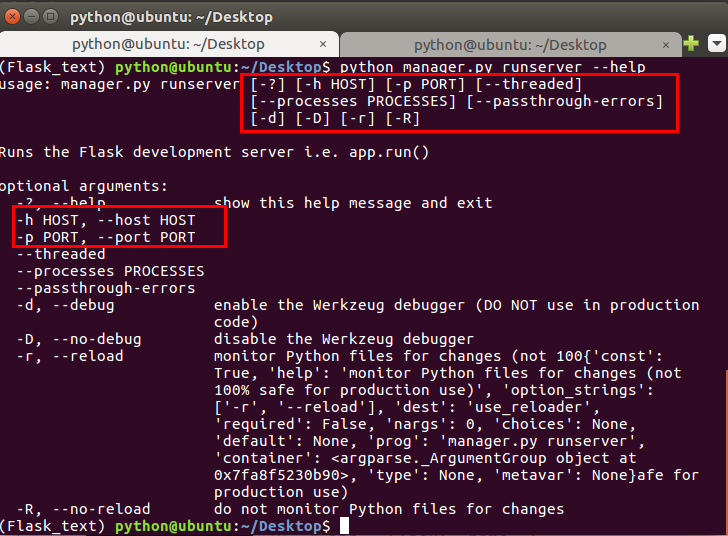

# Flask-Script 扩展

通过使用Flask-
Script扩展，我们可以在Flask服务器启动的时候，通过命令行的方式传入参数。而不仅仅通过app.run\(\)方法中传参，比如我们可以通过：



    python hello.py runserver -host ip地址
    


以上代码告诉服务器在哪个网络接口监听来自客户端的连接。默认情况下，服务器只监听来自服务器所在的计算机发起的连接，即localhost连接。

我们可以通过python hello.py runserver --help来查看参数。

## 代码实现

  * 安装 Flask-Script 扩展



    pip install flask-script
    


  * 集成 Flask-Script



    from flask import Flask
    from flask_script import Manager
    
    app = Flask(__name__)
    # 把 Manager 类和应用程序实例进行关联
    manager = Manager(app)
    
    @app.route('/')
    def index():
        return '床前明月光'
    
    if __name__ == "__main__":
        manager.run()
    


> Flask-Script 还可以为当前应用程序添加脚本命令，后续项目中会使用到

____

