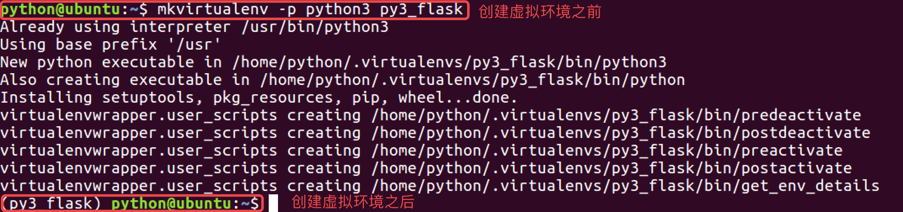
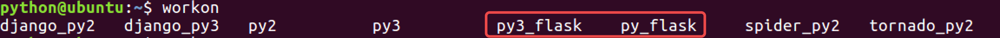
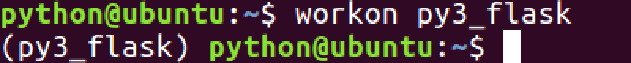
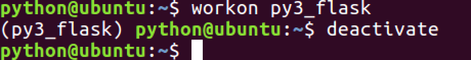
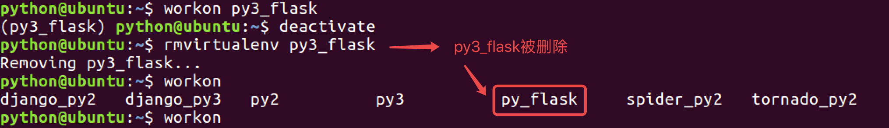
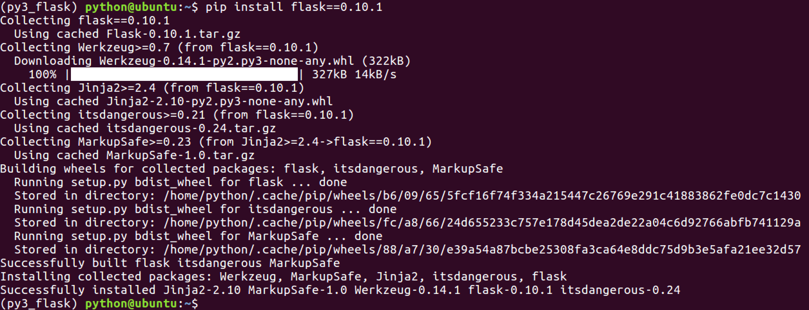
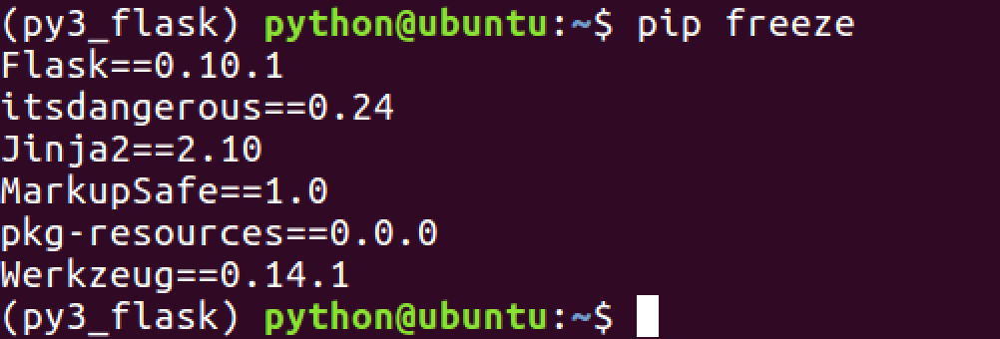

# 虚拟环境

## 为什么要搭建虚拟环境?

  * 在开发过程中, 当需要使用`python`的某些工具包/框架时需要联网安装
    * 比如联网安装Flask框架`flask-0.10.1`版本



    sudo pip install flask==0.10.1
    


  * **提 示**：使用如上命令, 会将`flask-0.10.1`安装到`/usr/local/lib/python2.7/dist-packages`路径下
  * **问 题**：如果在一台电脑上, 想开发多个不同的项目, 需要用到同一个包的不同版本, 如果使用上面的命令, 在同一个目录下安装或者更新, 新版本会覆盖以前的版本, 其它的项目就无法运行了.
  * **解 决方案** : `虚拟环境`
    * **作 用** : `虚拟环境`可以搭建独立的`python运行环境`, 使得单个项目的运行环境与其它项目互不影响.
    * 所有的`虚拟环境`都位于`/home/`下的隐藏目录`.virtualenvs`下

## 如何搭建虚拟环境?

  * 安装虚拟环境的命令 :



    sudo pip install virtualenv
    sudo pip install virtualenvwrapper
    


> 安装完虚拟环境后，如果提示找不到mkvirtualenv命令，须配置环境变量：



    # 1、创建目录用来存放虚拟环境
    mkdir 
    $HOME/.virtualenvs
    
    # 2、打开~/.bashrc文件，并添加如下：
    export WORKON_HOME=$HOME/.virtualenvs
    source /usr/local/bin/virtualenvwrapper.sh
    
    # 3、运行
    source ~/.bashrc
    


  * 创建虚拟环境的命令 :

    * 提示：如果不指定python版本，默认安装的是python2的虚拟环境
    * 在python2中，创建虚拟环境
         mkvirtualenv 虚拟环境名称

        例 ：
        mkvirtualenv py_flask
        


    * 在python3中，创建虚拟环境
         mkvirtualenv -p python3 虚拟环境名称

        例 ：
        mkvirtualenv -p python3 py3_flask
        


  * 提示 :

    * 创建虚拟环境需要联网
    * 创建成功后, 会自动工作在这个虚拟环境上
    * 工作在虚拟环境上, 提示符最前面会出现 "虚拟环境名称"

## 如何使用虚拟环境?

  * 查看虚拟环境的命令 :



    workon 两次tab键
    


  * 使用虚拟环境的命令 :



    workon 虚拟环境名称
    
    例 ：使用python2的虚拟环境
    workon py_flask
    
    例 ：使用python3的虚拟环境
    workon py3_flask
    


  * 退出虚拟环境的命令 :



    deactivate
    


  * 删除虚拟环境的命令 :



    rmvirtualenv 虚拟环境名称
    
    例 ：删除虚拟环境py3_flask
    
    先退出：deactivate
    再删除：rmvirtualenv py3_flask
    


## 如何在虚拟环境中安装工具包?

  * 提示 : 工具包安装的位置 :

    * python2版本下：
      * `~/.virtualenvs/py_flask/lib/python2.7/site-packages/`
    * python3版本下：
      * `~/.virtualenvs/py3_flask/lib/python3.5/site-packages`
  * python3版本下安装flask-0.10.1的包 :



    pip install 包名称
    
    例 : 安装flask-0.10.1的包
    pip install flask==0.10.1
    


  * 查看虚拟环境中安装的包 :



    pip freeze
    


____

