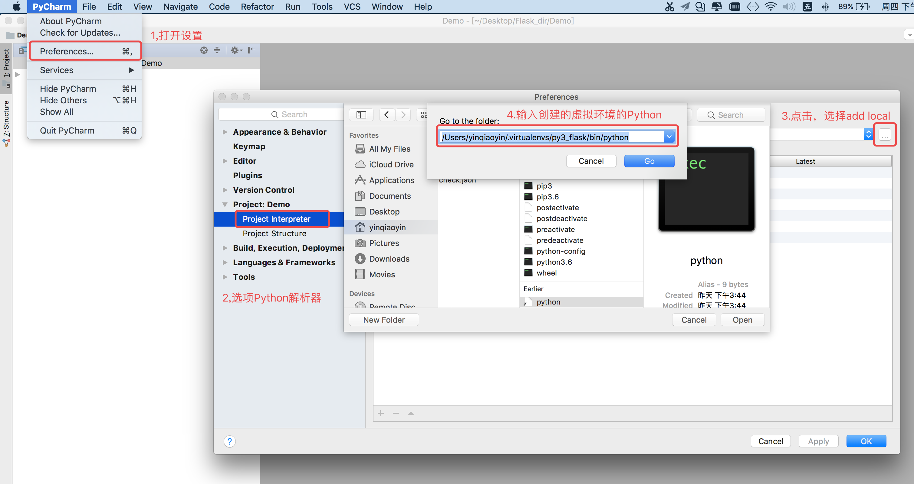
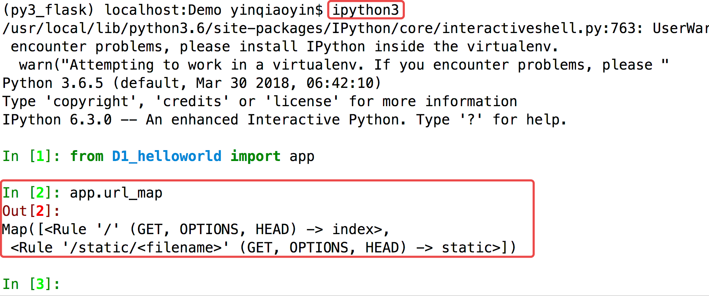

# HelloWorld程序

## 创建 Python 项目

  * 打开 Pycharm，创建 `Pure Python` 类型的项目，创建项目完成之后选择之前创建的 `py3_flask` 作为虚拟环境

> 第 4 步路径可以通过在指定虚拟环境下，输入 `which python` 获得

## 示例：

  * 新建文件helloworld.py
  * 导入Flask类



    from flask import Flask
    


Flask函数接收一个参数\_\_name\_\_，它会指向程序所在的包



    app = Flask(__name__)
    


  * 装饰器的作用是将路由映射到视图函数 index



    @app.route('/')
    def index():
        return 'Hello World'
    


  * Flask应用程序实例的 run 方法 启动 WEB 服务器



    if __name__ == '__main__':
        app.run()
    


  * 在程序运行过程中，程序实例中会使用 `url_map` 将装饰器路由和视图的对应关系保存起来，打印结果如下图：

____

