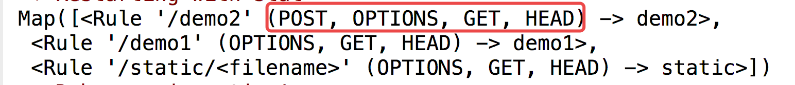
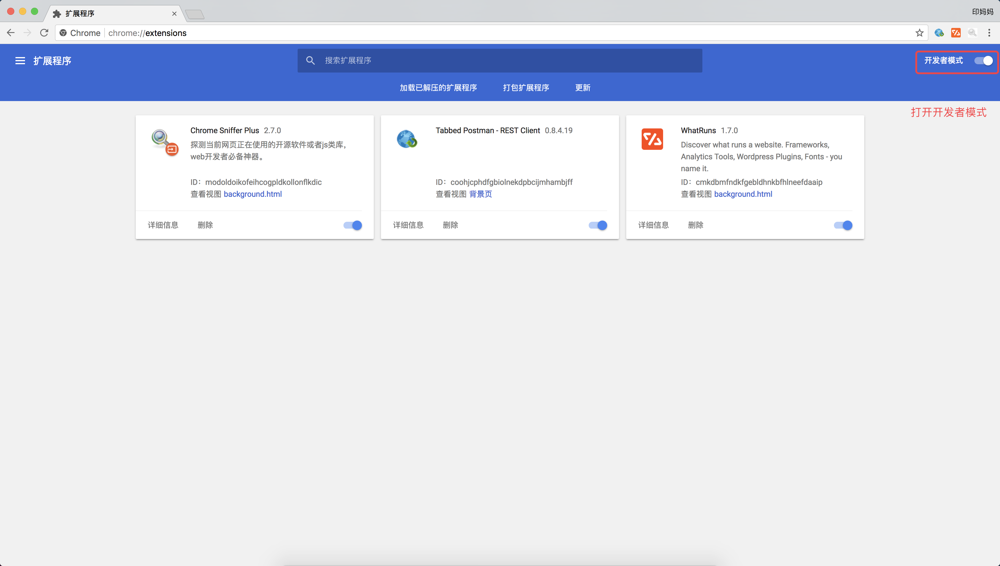

# 路由基本定义

  * 明确路由定义的参数，请求方式指定
  * PostMan 的使用

## 指定路由地址



    # 指定访问路径为 demo1
    @app.route('/demo1')
    def demo1():
        return 'demo1'
    


## 给路由传参示例

有时我们需要将同一类 URL 映射到同一个视图函数处理，比如：使用同一个视图函数来显示不同用户的个人信息。



    # 路由传递参数
    @app.route('/user/&lt;user_id&gt;')
    def user_info(user_id):
        return 'hello %s' % user_id
    


  * 路由传递的参数默认当做 string 处理，也可以指定参数的类型



    # 路由传递参数
    @app.route('/user/&lt;int:user_id&gt;')
    def user_info(user_id):
        return 'hello %d' % user_id
    


> 这里指定int，尖括号中的内容是动态的，在此暂时可以理解为接受 int 类型的值，实际上 int 代表使用 IntegerConverter 去处理
url 传入的参数

## 指定请求方式

在 Flask 中，定义一个路由，默认的请求方式为：

  * GET
  * OPTIONS\(自带\)
  * HEAD\(自带\)

如果想添加请求方试，那么可以如下指定：



    @app.route('/demo2', methods=['GET', 'POST'])
    def demo2():
        # 直接从请求中取到请求方式并返回
        return request.method
    


demo2 请求方式为：

### 使用 PostMan 对请求进行测试

PostMan 是一款功能强大的网页调试与发送网页 HTTP 请求的 Chrome
插件，可以直接去对我们写出来的路由和视图函数进行调试，作为后端程序员是必须要知道的一个工具。

  * 安装方式1：去 Chrome 商店直接搜索 PostMan 扩展程序进行安装
  * 安装方式2：https://www.getpostman.com/ 官网下载桌面版
  * 安装方式3：将已下载好的 PostMan 插件文件夹拖入到浏览器

    * 打开 Chrome 的扩展程序页面，打开 `开发者模式` 选项 
    * 将插件文件夹拖入到浏览器\(或者点击加载已解压的扩展程序选择文件夹\)
      * 在 Mac 下生成桌面图标，可以点击启动
      * 在 ubuntu 旧版的 Chrome 浏览器中会显示以下效果，可以直接点击启动 
  * 使用 PostMan，打开之后，会弹出注册页面，选择下方的 `Skip this,go straight to the app` 进行程序

____

