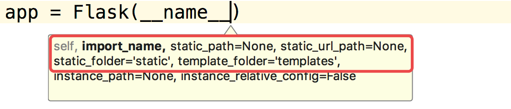
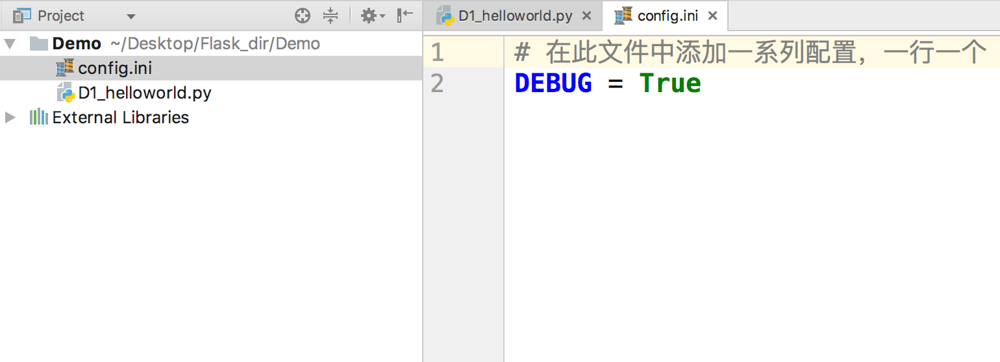
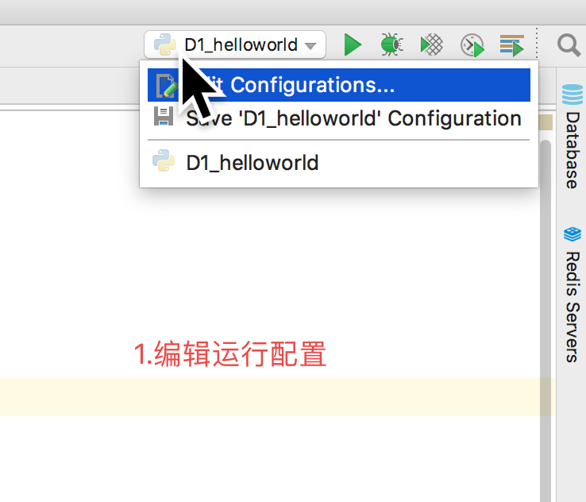
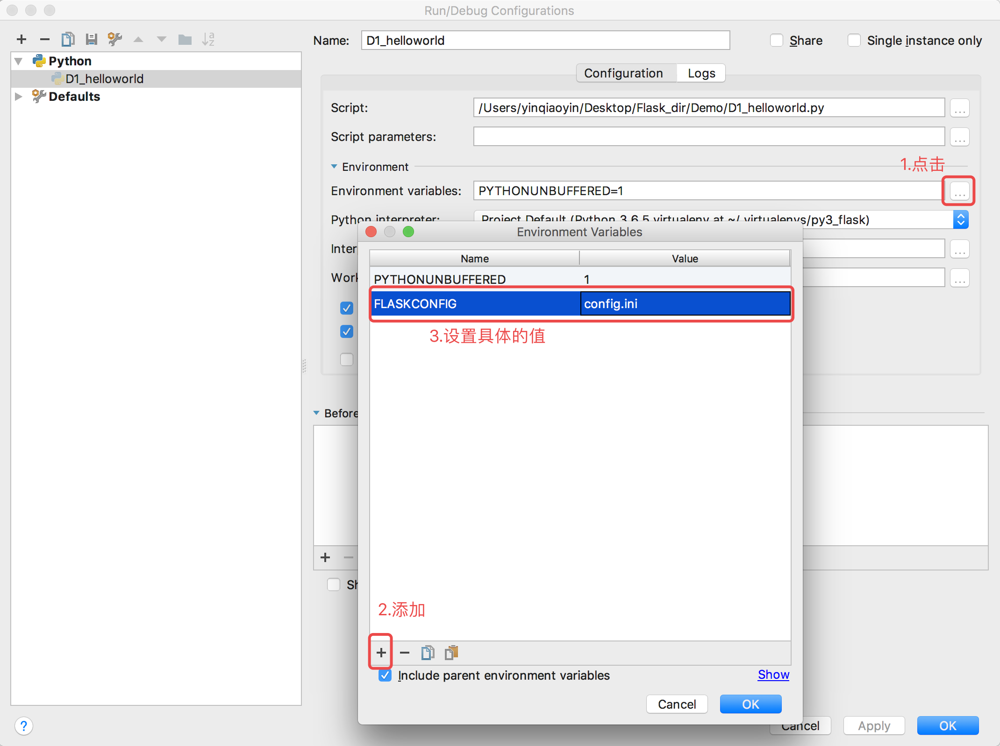

# 相关配置参数

在上一节实现了一个最简单的 Flask 应用程序，只使用了7行代码，接来对 Flask 程序的创建，运行配置做进一步的了解，具体有：

  * Flask 程序初始化参数
  * Flask 程序相关配置加载方式
  * app.run\(\) 参数

## 初始化参数

Flask 程序实例在创建的时候，需要默认传入当前 Flask 程序所指定的包\(模块\)，接下来就来详细查看一下 Flask
应用程序在创建的时候一些需要我们关注的参数：

  * import\_name
    * Flask程序所在的包\(模块\)，传 `__name__` 就可以
    * 其可以决定 Flask 在访问静态文件时查找的路径
  * static\_path
    * 静态文件访问路径\(不推荐使用，使用 static\_url\_path 代替\)
  * static\_url\_path
    * 静态文件访问路径，可以不传，默认为：`/ + static_folder`
  * static\_folder
    * 静态文件存储的文件夹，可以不传，默认为 `static`
  * template\_folder
    * 模板文件存储的文件夹，可以不传，默认为 `templates`

## 程序加载配置

在 Flask 程序运行的时候，可以给 Flask 设置相关配置，比如：配置 Debug 模式，配置数据库连接地址等等，设置 Flask
配置有以下三种方式：

  * 从配置对象中加载\(常用\)
    * app.config.form\_object\(\)
  * 从配置文件中加载
    * app.config.form\_pyfile\(\)
  * 从环境变量中加载\(了解\)
    * app.config.from\_envvar\(\)

> 以下演练以设置应用程序的 DEBUG\(调试模式\) 为例，设置应用为调式模式这后，可以实现以下功能：

>

>   1. 程序代码修改后可以自动重启服务器

>   2. 在服务器出现相关错误的时候可以直接将错误信息进行抛出到控制台打印

>

### 使用方式

#### 配置对象

  * 从配置对象中加载，创建配置的类，代码如下：



    # 配置对象，里面定义需要给 APP 添加的一系列配置
    class Config(object):
        DEBUG = True
    
    
    # 创建 Flask 类的对象,指向程序所在的包的名称
    app = Flask(__name__)
    
    # 从配置对象中加载配置
    app.config.from_object(Config)
    


> 运行测试，在修改代码之后直接保存，会自动重启服务器

#### 配置文件

  * 创建配置文件 `config.ini`，在配置文件中添加配置

  * 使用代码去加载配置



    # 创建 Flask 类的对象,指向程序所在的包的名称
    app = Flask(__name__)
    
    # 从配置文件中加载配置
    app.config.from_pyfile('config.ini')
    


#### 环境变量\(了解\)

  * 编辑运行的相关配置

  * 使用代码去加载配置



    # 创建 Flask 类的对象,指向程序所在的包的名称
    app = Flask(__name__)
    # 加载指定环境变量名称所对应的相关配置
    app.config.from_envvar('FLASKCONFIG')
    


### 读取配置

  * app.config.get\(\)
  * 在视图函数中使用 current\_app.config.get\(\)

> 注：Flask 应用程序将一些常用的配置设置成了应用程序对象的属性，也可以通过属性直接设置/获取某些配置：app.debug = True

## app.run的参数

  * 可以指定运行的主机IP地址，端口，是否开启调试模式



    app.run(host="0.0.0.0", port=5000, debug = True)
    


____

