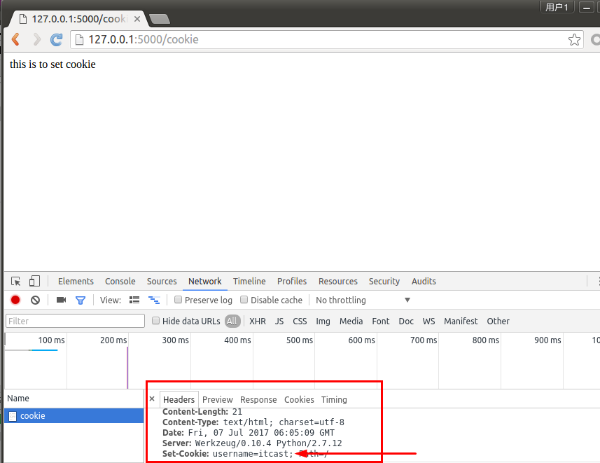
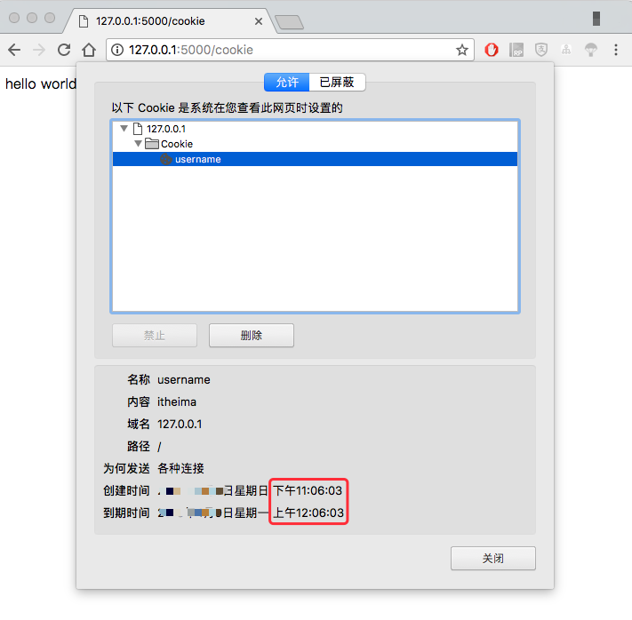
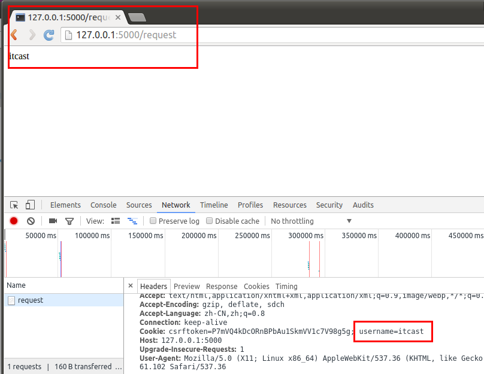

# Cookie

  * **Cookie** ：指某些网站为了辨别用户身份、进行会话跟踪而储存在用户本地的数据（通常经过加密）。
    * 复数形式Cookies。
    * Cookie最早是网景公司的前雇员Lou Montulli在1993年3月的发明。
    * Cookie是由服务器端生成，发送给客户端浏览器，浏览器会将Cookie的key/value保存，下次请求同一网站时就发送该Cookie给服务器（前提是浏览器设置为启用cookie）。
    * Cookie的key/value可以由服务器端自己定义。
  * **应 用**：
    * 最典型的应用是判定注册用户是否已经登录网站，用户可能会得到提示，是否在下一次进入此网站时保留用户信息以便简化登录手续，这些都是Cookie的功用。
    * 网站的广告推送，经常遇到访问某个网站时，会弹出小窗口，展示我们曾经在购物网站上看过的商品信息。
    * 购物车，用户可能会在一段时间内在同一家网站的不同页面中选择不同的商品，这些信息都会写入Cookie，以便在最后付款时提取信息。
  * **提 示**：

    * Cookie是存储在浏览器中的一段纯文本信息，建议不要存储敏感信息如密码，因为电脑上的浏览器可能被其它人使用
    * Cookie基于域名安全，不同域名的Cookie是不能互相访问的
      * 如访问itcast.cn时向浏览器中写了Cookie信息，使用同一浏览器访问baidu.com时，无法访问到itcast.cn写的Cookie信息
      * 浏览器的同源策略
    * 当浏览器请求某网站时，会将本网站下所有Cookie信息提交给服务器，所以在request中可以读取Cookie信息

## 设置cookie



    from flask imoprt Flask,make_response
    @app.route('/cookie')
    def set_cookie():
        resp = make_response('this is to set cookie')
        resp.set_cookie('username', 'itcast')
        return resp
    


  * 设置过期时间



    @app.route('/cookie')
    def set_cookie():
        response = make_response('hello world')
        response.set_cookie('username', 'itheima', max_age=3600)
        return response
    


## 获取cookie



    from flask import Flask,request
    #获取cookie
    @app.route('/request')
    def resp_cookie():
        resp = request.cookies.get('username')
        return resp
    


____

