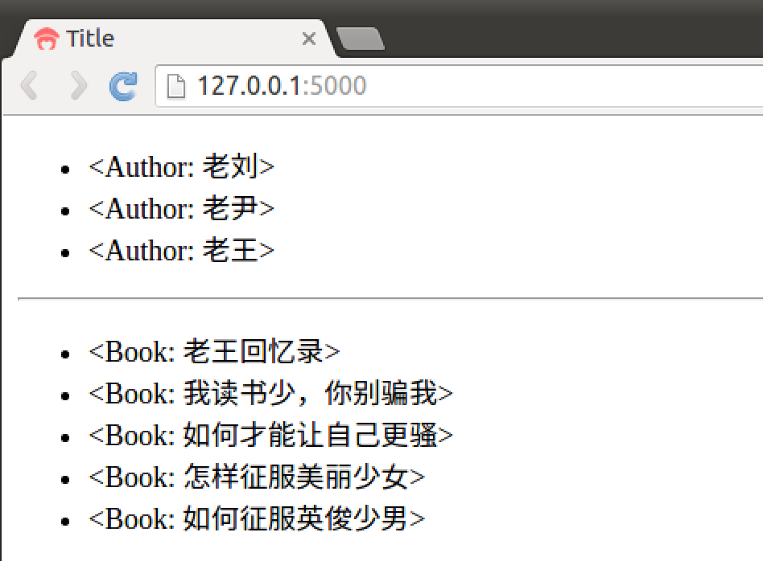
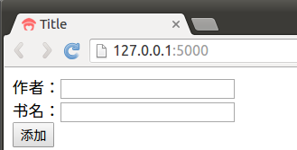

# 数据显示&表单添加

## 数据显示

  * 定义路由函数，并将 Author 和 Book 的所有结果传到模板



    @app.route('/',methods=['GET','POST'])
    def index():
        author = Author.query.all()
        book = Book.query.all()
        return render_template('index.html',author=author,book=book)
    


  * 模版关键代码



    &lt;ul&gt;
        
        &lt;li&gt;{{ x }}&lt;/li&gt;
        
    &lt;/ul&gt;
    &lt;hr&gt;
    &lt;ul&gt;
        
        &lt;li&gt;{{ x }}&lt;/li&gt;
        
    &lt;/ul&gt;
    


  * 效果图 

## 表单添加

  * 定义表单类



    from flask_wtf import FlaskForm
    from wtforms.validators import DataRequired
    from wtforms import StringField,SubmitField
    #创建表单类，用来添加信息
    class Append(FlaskForm):
        au_info = StringField(validators=[DataRequired()])
        bk_info = StringField(validators=[DataRequired()])
        submit = SubmitField(u'添加')
    


  * 传入至模版中



    #创建表单对象
    @app.route('/',methods=['GET','POST'])
    def index():
        author = Author.query.all()
        book = Book.query.all()
        form = Append()
        return render_template('index.html',author=author,book=book,form=form)
    


  * 模板中代码



    &lt;form method="post"&gt;
        {{ form.csrf_token }}
        &lt;p&gt;作者：{{ form.au_info }}&lt;/p&gt;
        &lt;p&gt;书名：{{ form.bk_info }}&lt;/p&gt;
        &lt;p&gt;{{ form.submit }}&lt;/p&gt;
    &lt;/form&gt;
    


  * 效果图

____

